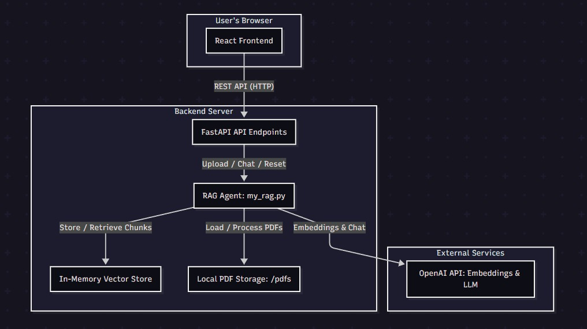
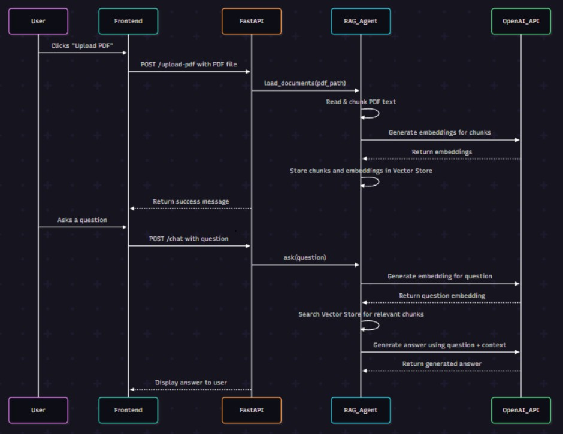

# 🚀 Knowledge Based Search Engine

**[🌐 Live Demo → https://ai-planet-chat.onrender.com/](https://ai-planet-chat.onrender.com/)**

Transform your static PDF documents into dynamic conversational experiences with AI-powered question-answering!

---

## 🎯 Overview

**AI Planet** is a comprehensive full-stack web application that enables users to upload multiple PDF documents and interact with their content through natural language questions. Leveraging state-of-the-art Retrieval-Augmented Generation (RAG) architecture, the system combines efficient document processing, semantic search, and large language models (LLMs) to deliver accurate, context-aware responses. Built with modern technologies, it caters to researchers, students, professionals, and anyone seeking intelligent document analysis.

---

## 🌟 Key Features

- **Multi-PDF Upload & Management**  
  Drag-and-drop interface supporting multiple PDFs, with automatic text extraction and metadata storage.

- **Semantic Search & Retrieval**  
  Uses vector embeddings and in-memory vector stores for fast, relevant chunk retrieval.

- **AI-Powered Question Answering**  
  Contextually answers user questions based on uploaded documents, maintaining conversation history for coherence.

- **Source Citation & Transparency**  
  Responses include references to original document sections for verification.

- **Responsive & User-Friendly UI**  
  Modern, mobile-responsive interface with real-time status updates, loading indicators, and intuitive navigation.

---

## 🏗️ Architecture Overview
<p align="center">
  
</p>


---

## 🏗️ Sequence Diagram

<p align="center">
  
</p>

---

## 🧩 Core Components Breakdown

### Frontend (React.js)
- Modular components for uploading PDFs, viewing document list, status of Agent, and engaging in chat conversations.

### Backend (FastAPI)
- RESTful endpoints using FastAPI for file uploads, question queries, document management, with business logic for processing.

### Processing Layer
- Uses PyPDF for text extraction, LangChain for chunking, and Gemini APIs for embeddings and language modeling.

### Storage Layer
- Stores uploaded files locally, maintains in-memory vector stores for fast retrieval, and optionally persists metadata.

---

## 🔧 Implementation Details

### Backend
- **Framework:** FastAPI (Python 3.8+)
- **PDF Processing:** PyPDF extracts text from PDFs.
- **Text Chunking:** LangChain's RecursiveCharacterTextSplitter splits large texts into manageable chunks.
- **Embeddings & Search:** Utilizes embeddings (e.g., from Google's models) to generate vectors; In-memory vector store performs similarity search.
- **Question Answering:** Google's Gemini model (via MyRAGAgent) processes retrieved context and conversation history to generate responses.

### Frontend
- **Framework:** React.js (v18+) (Vite)
- **Features:** Drag-and-drop PDF upload, document list, chat interface with message history, real-time updates.
- **Styling:** Responsive CSS with modern UI/UX principles, inspired by Figma design.

---

## 📝 Setup & Deployment

### Backend Setup

```bash
# Clone repo and navigate
git clone https://github.com/Dheeraj-Kumar2004/Knowledge-base-Search-Engine
cd AI_PLANET_/server

# Create virtual environment
python -m venv venv
venv\Scripts\activate

# Install dependencies
pip install -r requirements.txt

# Configure environment variables (.env)
# NOTE: The system now uses the Gemini API.
GEMINI_API_KEY=your_gemini_api_key

# Run backend server
uvicorn app.main:app --reload
```

### Frontend Setup

```bash
# Navigate to client directory
cd ../client

# Install dependencies
npm install

# Set environment variable
# Create .env file with:
# VITE_API_BASE_URL=http://localhost:8000

# Start development server
npm run dev
```

### Access the Application

- **Frontend:** http://localhost:3000  
- **Backend API Docs:** http://localhost:8000/docs
- **Backend Status: http://localhost:8000/status
- **Backend Health: http://localhost:8000/health

---

## 🛠️ Features & Enhancements

- **Multi-Document Support:** Upload and manage multiple PDFs simultaneously.
- **Contextual Chat:** Maintains conversation history for coherent Q&A.
- **Source References:** Responses include document snippets for transparency.
- **Progress Indicators:** Visual feedback during uploads and processing.
- **Error Handling:** Clear messages for unsupported files or errors.
- **Responsive Design:** Works seamlessly on desktops and mobiles.

---

## 🔒 Security & Privacy

- **API Keys:** Stored securely in environment variables.
- **File Validation:** Only PDFs allowed; size limits enforced.
- **Data Handling:** Files stored locally; conversation data session-based.

---
